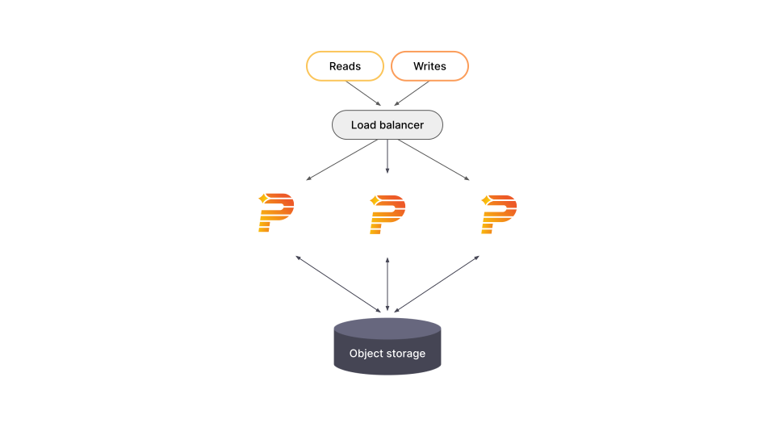

# Grafana Phlare deployment modes

You can deploy Grafana Phlare in one of two modes:

- Monolithic mode
- Microservices mode

The deployment mode is determined by the `-target` parameter, which you can set via CLI flag or YAML configuration.

## Monolithic mode

The monolithic mode runs all required components in a single process and is the default mode of operation, which you can set by specifying `-target=all`. Monolithic mode is the simplest way to deploy Grafana Phlare and is useful if you want to get started quickly or want to work with Grafana Phlare in a development environment. To see the list of components that run when `-target` is set to `all`, run Grafana Phlare with the `-modules` flag:

```bash
./phlare -modules
```

[//]: # "Diagram source at https://docs.google.com/presentation/d/1LemaTVqa4Lf_tpql060vVoDGXrthp-Pie_SQL7qwHjc/edit#slide=id.g11694eaa76e_0_0"


Monolithic mode can be horizontally scaled out by deploying multiple Grafana Phlare binaries with `-target=all`. This approach provides high-availability and increased scale without the configuration complexity of the full [microservices deployment](#microservices-mode).

[//]: # "Diagram source at https://docs.google.com/presentation/d/1LemaTVqa4Lf_tpql060vVoDGXrthp-Pie_SQL7qwHjc/edit#slide=id.g11658e7e4c6_1_20"



## Microservices mode

In microservices mode, components are deployed in distinct processes. Scaling is per component, which allows for greater flexibility in scaling and more granular failure domains. Microservices mode is the preferred method for a production deployment, but it is also the most complex.

In microservices mode, each Grafana Phlare process is invoked with its `-target` parameter set to a specific Grafana Phlare component (for example, `-target=ingester` or `-target=distributor`). To get a working Grafana Phlare instance, you must deploy every required component. For more information about each of the Grafana Phlare components, refer to [Architecture]().

If you are interested in deploying Grafana Phlare in microservices mode, we recommend that you use [Kubernetes](https://kubernetes.io/).

[//]: # "Diagram source at https://docs.google.com/presentation/d/1LemaTVqa4Lf_tpql060vVoDGXrthp-Pie_SQL7qwHjc/edit#slide=id.g11658e7e4c6_1_53"


